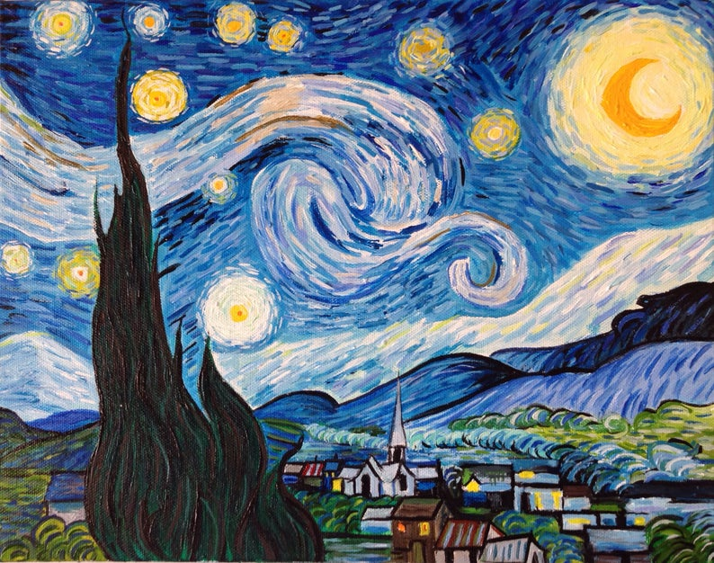
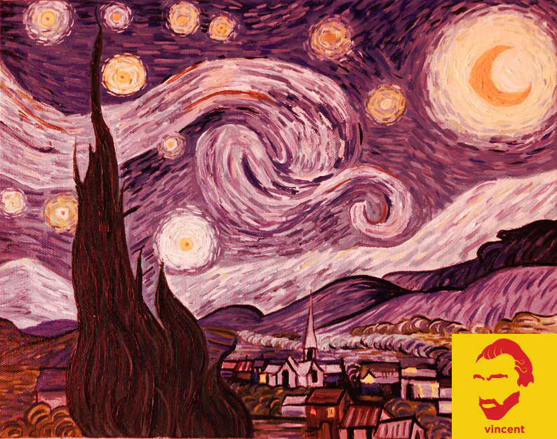

# Cloudinary's Guess the Transformation Challenge: React Live Amsterdam

### 

### This challenge involves guessing a Cloudinary transformation URL that produces a given target image from one \(or more\) given source image\(s\).

## Source Images:

#### Source image \#1: [https://res.cloudinary.com/demo/image/upload/starry-night.jpg](https://res.cloudinary.com/demo/image/upload/starry-night.jpg)

#### Source image \#2: [https://res.cloudinary.com/demo/image/upload/vincent-1.jpg](https://res.cloudinary.com/demo/image/upload/vincent-1.jpg)

## **W**arm-Up Transformation Example:

\*\*\*\*[**https://res.cloudinary.com/demo/image/upload/e\_tint:50:red/l\_vincent-1,g\_south\_east/starry-night.jpg**](https://res.cloudinary.com/demo/image/upload/e_tint:50:red/l_vincent-1,g_south_east/starry-night.jpg)

## NOW YOU TRY! 😀



